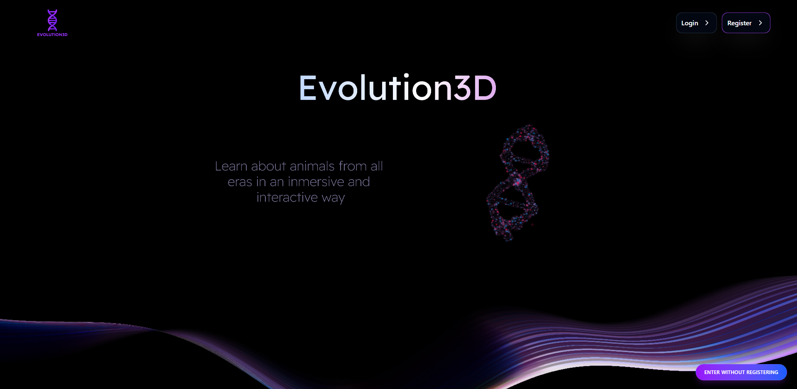
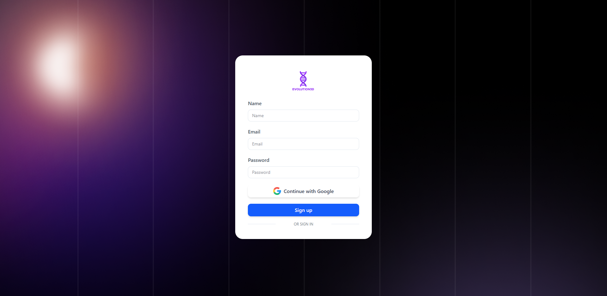
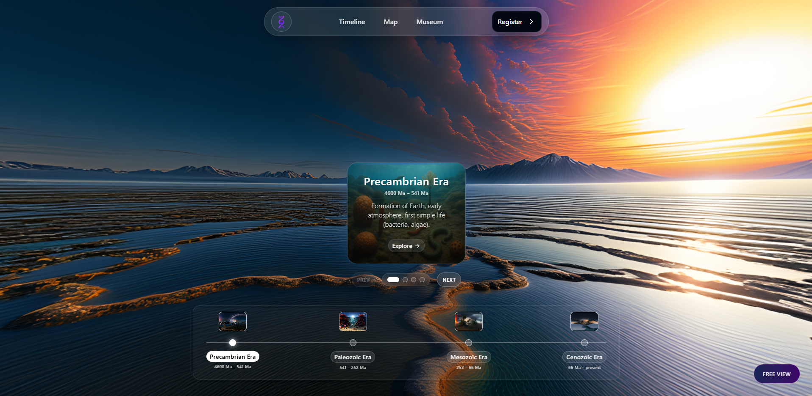
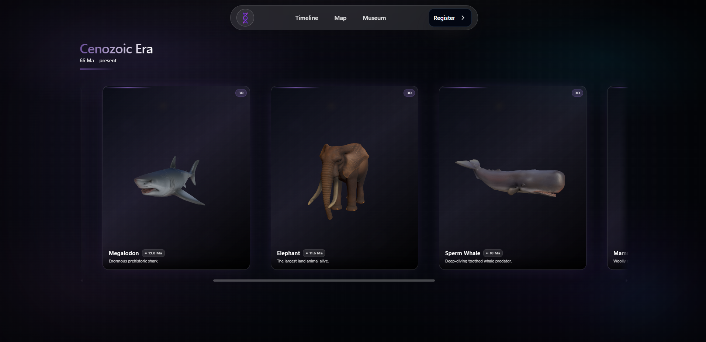
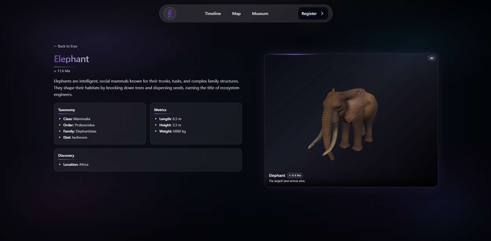
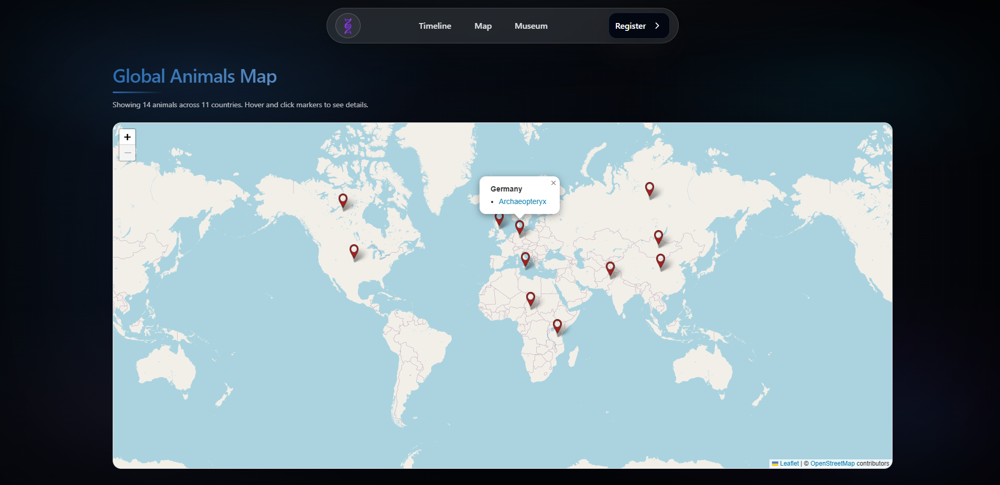
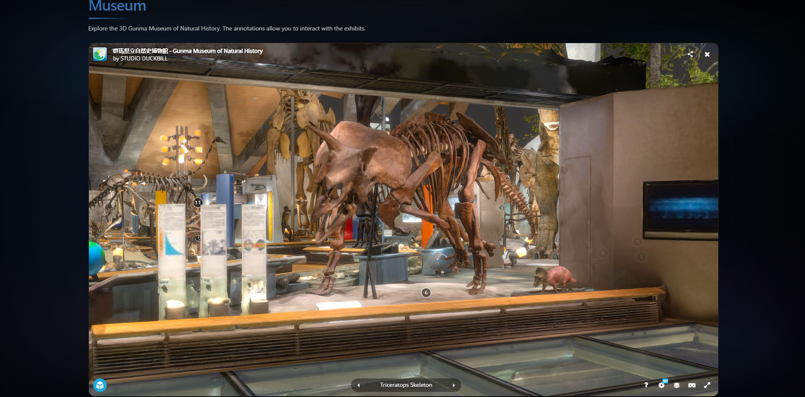
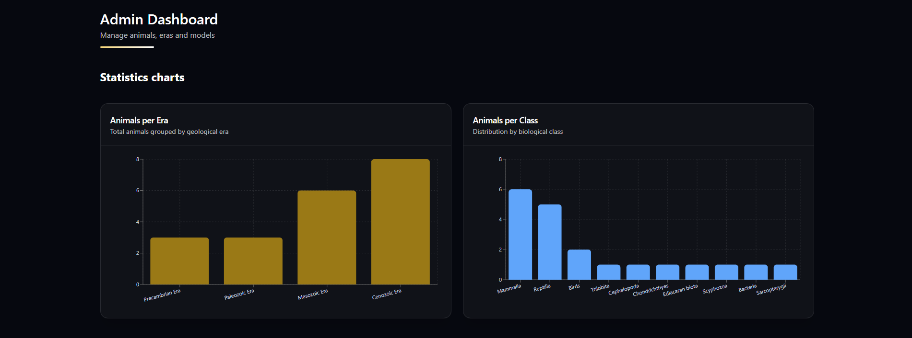
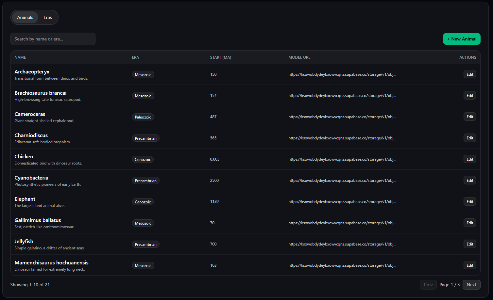
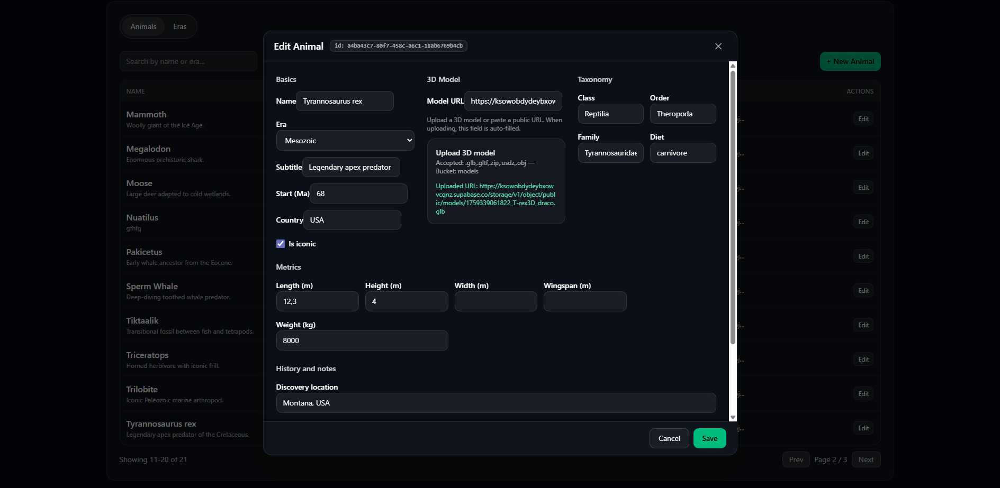

<div align="center">
	
	<h3>Learn about animals from all eras in an inmersive and interactive way</h3>

	


</div>

---

## 🚀 Demo

👉 <a href="https://evolution3d.vercel.app/"> evolution3d.vercel.app </a>

## 🧠 Overview

Evolution3D is a web application designed to explore animals across different biological eras using an interactive 3D environment.

The application combines:

- Real-time 3D rendering (Three.js).
- Dynamic data from a backend (Supabase).
- An admin dashboard to manage content and assets.
  
<br>

<details>
      
  <summary>🔐 Admin Dashboard</summary>
  

&nbsp;&nbsp;&nbsp;**A protected admin interface allows managing the system data:**

- Role-based access control (RBAC)
- Protected routes using authentication guards
- CRUD operations for:
  - Animals
  - Geological eras
  - 3D assets and media

</details>

  <br>

Users can navigate through timelines, explore species, and interact with 3D models, while administrators can manage the underlying data through a protected interface.

---

## 🎥 Preview

### 🧬 Evolution3D Preview


---

### 🏠 Home Page


---

### 🔐 Authentication Page


---
### ⏰ Timeline Page


---

### 🌄🏞️ Era Page


---

### 🦖 Animal Page


---

### 🗺️ Map Page


---

### 📸 Museum Page


---

### 📊🧮 Dashboard Page 






---

## 🛠️ Getting Started

### 1️⃣ Clone this repository

```bash
https://github.com/JLrodriguez31/Evolution3D.git

```

### 2️⃣ Install Dependencies

Make sure you have Node.js installed. Then install the packages:

```bash
npm install
```

### 3️⃣ Start Development Server

```bash
npm run dev
```

---

## 🏗 Architecture

The system is structured into three main layers:

### 🔷 3D Rendering Layer

- Handles scene creation, rendering loop, and user interaction.
- Built with Three.js and React Three Fiber.
- Dynamically renders content based on backend data.

### 🔷 Data Layer

- Supabase (PostgreSQL) for persistent data storage.
- Authentication and user management.
- Storage for 3D assets (.glb models, images).

### 🔷 Application Layer

- React + TypeScript frontend
- TanStack Query for server state management
- Feature-based architecture separating UI, services, and logic

---

## 📁 Project Structure

```
📦 Evolution3D
┣ 📂 public
┣ 📂 preview
┣ 📂 src/
      ┣ 📂 assets  
      ┣ 📂 features
         ┣ 📂 admin
            ┣ 📂 components
                ┣ 📄 AuthProvider.tsx
                ┣ 📄 ProtectedRoute.tsx
                ┣ 📄 UseAuth.ts
                ┗ 📄 AuthService.ts
            ┗ 📂 Types
                ┗ 📄 budgetTypes.ts
         ┣ 📂 animals
            ┣ 📂 components
                ┣ 📄 Card3D.tsx
                ┣ 📄 DragSafeCard.tsx
                ┣ 📄 AnimalHeader.tsx
                ┣ 📄 EvolutionCarousel.tsx
                ┗ 📄 AnimalSpecs.tsx
            ┣ 📂 data
                ┣ 📄 services.ts
            ┣ 📂 hooks
                ┣ 📄 useSelestableServices.ts
            ┣ 📂 lib
                ┣ 📄 calculateTotal.ts
            ┗ 📂 Types
                ┗ 📄 servicesTypes.ts  
         ┗ 📂 timeline
            ┣ 📂 skydome
            ┗ 📂 ui
      ┣ 📂 pages
         ┣ 📄 AdminPage.tsx
         ┣ 📄 AnimalPage.tsx
         ┣ 📄 EraPage.tsx
         ┣ 📄 LoginPage.tsx
         ┣ 📄 MapPage.tsx
         ┣ 📄 MusueumPage.tsx
         ┣ 📄 TimelinePage.tsx
         ┣ 📄 RegisterPage.tsx
         ┗ 📄 WelcomePage.tsx
      ┣ 📂 router
      ┣ 📂 services
         ┣ 📄 animals.ts
         ┗ 📄 eras.ts
      ┣ 📄 app.tsx
      ┣ 📄 main.tsx
      ┗ 📄 styles.css
┗ 📄 index.html

```

---

## 🛠 Technologies Used

    - TypeScript
    - React (React Router, Recharts, React Leaflet, Shadcn, TanStack Query, TanStack Tables)
    - HTML
    - CSS (Tailwind)
    - Three.js (React Three Fiber)
    - Vitest
    - Supabase (PostgreSQL, Auth, Storage)
    - Figma
    - Blender
    - Spline
    - Sketchfab Viewer API
    - Vercel
    

## ⏳ Project Status

  
